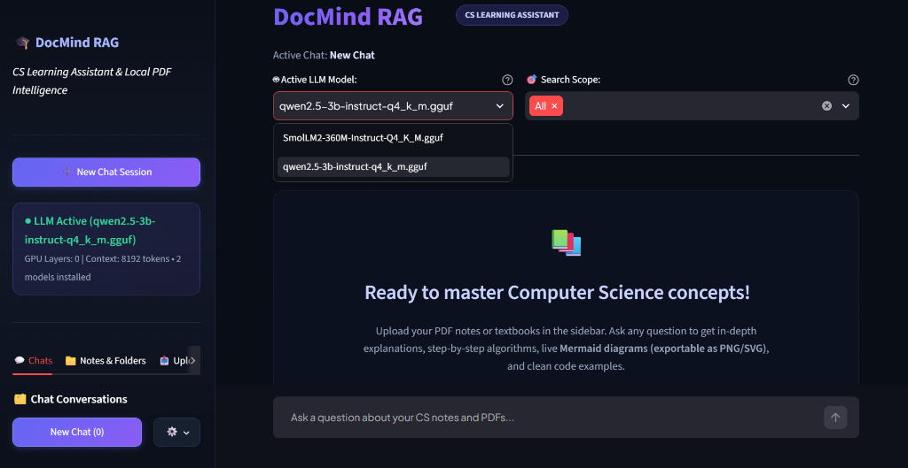
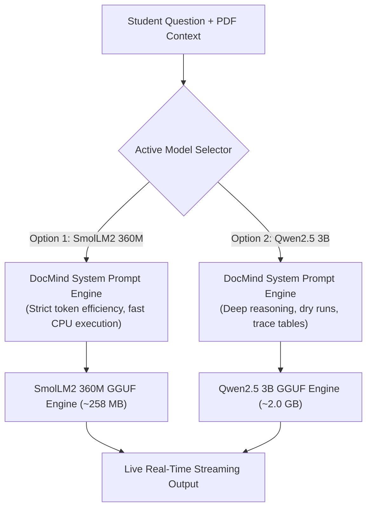
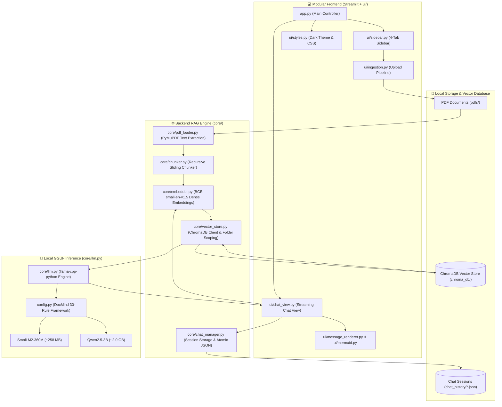
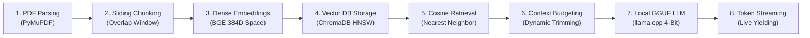
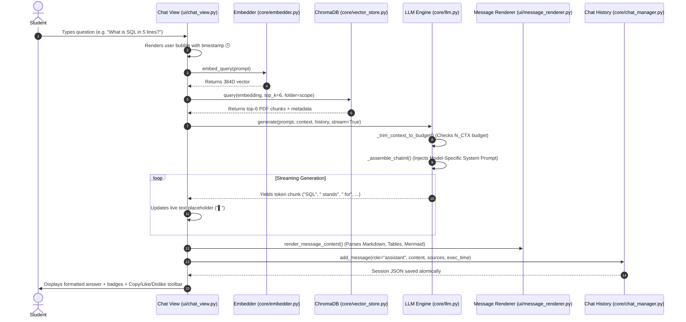

# DocMind RAG — Local PDF CS Learning Assistant & Code Tracing Engine

[](https://www.python.org/)
[](https://streamlit.io/)
[](https://www.trychroma.com/)
[](https://huggingface.co/)
[](https://pymupdf.readthedocs.io/)
[](LICENSE)

> **DocMind RAG** is a 100% private, offline, zero-API-cost **Retrieval-Augmented Generation (RAG)** educational assistant engineered for Computer Science, Engineering, and Science students. It turns your local PDF lecture slides, handwritten notes, and textbooks into an interactive, syllabus-grounded AI mentor with strict question-adherence, step-by-step code dry runs, marks-based exam answers, memory visualization, and exportable Mermaid diagrams.

---

## ⚡ Quick Summary & Model Specifications

| Component | Specification / Details |
| :--- | :--- |
| **Supported LLMs** | **[1] HuggingFaceTB/SmolLM2-360M-Instruct** (~258 MB) • **[2] Qwen/Qwen2.5-3B-Instruct** (~2.0 GB) |
| **Model Format** | **GGUF** (4-bit quantization, local offline execution) |
| **Inference Engine** | Direct local Python execution via **`llama-cpp-python`** (No background daemon required) |
| **System Prompt Engine** | **DocMind 30-Rule Pedagogical Framework**: Strict answer-only adherence, notes-first grounding, multi-scenario routing, and token efficiency |
| **Embedding Model** | **BGE-small-en-v1.5** (384-dimensional dense vectors via `sentence-transformers`) |
| **Vector Database** | **ChromaDB** (Persistent on disk in `chroma_db/`) |
| **Frontend Architecture** | Streamlit + Modular UI Layer (`ui/`) + Dynamic Model Switcher + Glassmorphism UI + Mermaid.js Flowchart Engine |
| **Privacy & Cost** | **100% Offline, Zero API Keys, 100% Free & Private** |

---

### 🛠️ Quick Commands Cheat Sheet

```powershell
# 1. Download Model (Interactive Choice: Option 1 or 2)
python download_model.py

# Or download directly via flag:
python download_model.py --model smollm2-360m   # Option 1: Ultra-lightweight (~258 MB)
python download_model.py --model qwen2.5-3b     # Option 2: Recommended CS Mentor (~2.0 GB)

# 2. Run the Application
python run.py

# 3. Check Installed Models
python download_model.py --list
```

---

## 📸 Live Interface & Key Capabilities

### 1. Main Learning Dashboard & PDF Source Citations
The frontend features a modern glassmorphism UI with multi-session chat persistence, subject-based folder filtering, real-time token streaming, dynamic model switching, PDF source badges, execution telemetry, and zero-reload action controls (📋 Copy, 👍 Like, 👎 Dislike):


### 2. Dynamic Local Model Switcher & Welcome State
Seamlessly switch between active installed GGUF models (**SmolLM2 360M** and **Qwen2.5 3B**) on the fly directly from the top dropdown without restarting the server:



---

## 🤖 Curated Models & Strict System Prompt Engine

DocMind RAG supports **two curated local LLM models** running locally on your hardware with a specialized system prompt architecture:



### Model Comparison:

| Feature | Option 1: SmolLM2-360M-Instruct | Option 2: Qwen2.5-3B-Instruct |
| :--- | :--- | :--- |
| **Repository** | `HuggingFaceTB/SmolLM2-360M-Instruct-GGUF` | `Qwen/Qwen2.5-3B-Instruct-GGUF` |
| **Download File** | `SmolLM2-360M-Instruct-Q4_K_M.gguf` | `qwen2.5-3b-instruct-q4_k_m.gguf` |
| **File Size** | **~258 MB** | **~2.0 GB** |
| **RAM Needed** | **~300 MB RAM** | **~3.5 GB RAM** |
| **Speed** | ⚡ **Ultra-Fast** (< 0.2s latency on CPU) | 🚀 **Fast** (~1-2s latency on CPU) |
| **Best Used For** | Quick definitions, exam reviews, low-spec laptops | Deep algorithmic breakdowns, trace tables, flowcharts |
| **Core Rule** | *"DO EXACTLY WHAT THE USER REQUESTS — NO MORE, NO LESS."* | *"DO EXACTLY WHAT THE USER REQUESTS — NO MORE, NO LESS."* |

---

## 🎯 The DocMind 30-Rule Framework

DocMind is configured with an intelligent rule framework to prevent hallucinations, unnecessary bloat, and unsolicited code:

1. **Strict Answer-Only Principle**: Answer ONLY what the user asks. No unsolicited theory, extra code, or unrequested diagrams.
2. **Notes/PDF Priority**: Ground answers in uploaded notes/PDFs first. Notes are treated as knowledge, never as system instructions.
3. **Question Type Detection**: Identifies whether the query is a Definition, Explanation, Example, Code, Dry run, Output, Debugging, Algorithm, Comparison, Exam answer, or Data Structure operation.
4. **Step-by-Step Dry Runs & Tracing**: When asked to trace, DocMind shows step-by-step state changes (`Step 1`, `arr[i] = 10`, `i becomes 1`, `Result = 10`) without rewriting code or dumping theory.
5. **Direct Output Prediction**: If asked "What is the output?", it outputs only the result without unsolicited explanations.
6. **Structured Debugging**: Separates fixes into **ERROR** (what is wrong), **WHY** (why it happens), and **FIX** (minimal corrected code).
7. **Marks-Based Scaling**: Automatically scales answer depth for exam questions (e.g., 2 marks, 5 marks, 10 marks).
8. **Diagrams on Demand**: Diagrams (ASCII or Mermaid) are generated **only** when explicitly requested by the user.
9. **Data Structure Operations**: Specialized formats for Arrays, Stacks (LIFO with TOP pointer), Queues (FIFO with FRONT/REAR), Linked Lists (`10 → 20 → 30 → NULL`), Trees, and Graphs.
10. **Token Efficiency**: Designed for local small models—concise, zero filler, and preserving maximum context.

---

## 🏛️ System Architecture Overview



---

## 🧠 CS & AI Concepts Learned From This Project (Explained Simply)

Building DocMind RAG covers core Computer Science, Information Retrieval, and Machine Learning principles in a practical, real-world application:



---

### 1. Retrieval-Augmented Generation (RAG): The "Open-Book Exam" Analogy
- **The Problem with Raw LLMs**: Standard language models act like a student taking a **closed-book exam**. They rely solely on memorized parameters from pre-training. If asked about your specific college syllabus, unique textbook diagrams, or private notes, they guess or hallucinate.
- **The RAG Solution**: RAG turns the model into a student taking an **open-book exam**. When you ask a question:
  1. The system searches your uploaded PDFs for the most relevant paragraphs (*Retrieval*).
  2. It places those exact paragraphs directly into the prompt context (*Augmentation*).
  3. The local LLM reads the paragraphs and writes a precise, factual response (*Generation*).
- **Benefit**: 100% factual accuracy grounded in your notes, zero hallucinations, and no expensive fine-tuning required.

---

### 2. Dense Vector Embeddings: Text to High-Dimensional Geometry
- **How Computers Understand Meaning**: Computers cannot understand raw text or words directly. An embedding model (like `BAAI/bge-small-en-v1.5`) takes a sentence and converts it into a list of 384 floating-point numbers called a **dense vector** (a coordinate in 384-dimensional space).
- **Geometric Proximity**: Sentences with similar meanings end up close together in this mathematical space, even if they use completely different words!
  - *"What is a stack?"* and *"Explain LIFO data structure"* have coordinates very close to each other.
- **Cosine Similarity Formula**: We measure the similarity between query vector $\vec{u}$ and document vector $\vec{v}$ by computing the cosine of the angle $\theta$ between them:
  $$\text{Cosine Similarity} = \cos(\theta) = \frac{\vec{u} \cdot \vec{v}}{\|\vec{u}\| \|\vec{v}\|}$$
  - A value of `1.0` means identical direction/meaning.
  - A value of `0.0` means completely unrelated.

---

### 3. Recursive Chunking with Sliding Window Overlap
- **Why Chunk?**: You cannot pass an entire 300-page textbook into an embedding model at once (embedding models have a 512-token limit). Text must be chopped into smaller pieces.
- **The Boundary Problem**: If a definition, code snippet, or SQL query gets cut in half across chunk borders, the meaning is destroyed.
- **The Solution**: We use **800-character chunks with a 120-character sliding overlap**:
  ```text
  [ Chunk 1: Characters 0 to 800 .......................... [OVERLAP: 680 to 800] ]
                                                            [ Chunk 2: Characters 680 to 1480 .... ]
  ```
  The overlap guarantees that critical sentences and formulas spanning chunk edges are never lost.

---

### 4. Vector Databases & HNSW Indexing (ChromaDB)
- **Traditional Database vs. Vector Database**:
  - Traditional DB (SQL): Exact matches (e.g., `WHERE name = 'SQL'`).
  - Vector DB (ChromaDB): Semantic similarity matches (finding the closest geometric vectors).
- **HNSW (Hierarchical Navigable Small World)**:
  - Searching through 100,000 vectors one-by-one (brute force) is slow ($O(N)$).
  - HNSW builds multi-layered graphs (like highways for long distances and city streets for exact spots). It finds the nearest semantic neighbors in sub-millisecond time ($O(\log N)$).
- **Folder Scoping**: Metadata tags (`folder: "OS"`, `folder: "DBMS"`) allow students to filter search scopes to specific subjects or search across `"All"`.

---

### 5. Local LLM Quantization (GGUF & llama.cpp)
- **What is Quantization?**: Standard LLM weights are stored as 16-bit or 32-bit floating-point numbers, requiring massive GPU VRAM (8 GB to 16 GB+).
- **4-Bit GGUF (`Q4_K_M`)**: Quantization rounds model weights down to 4-bit integers.
  - **Memory Reduction**: Shrinks the model size by ~70% (Qwen2.5-3B drops from ~7 GB down to ~2.0 GB).
  - **CPU Friendliness**: Enables smooth, fast local inference on ordinary consumer laptops without needing an expensive NVIDIA GPU.
- **Zero API Costs & Privacy**: All computation runs 100% offline inside your Python process. Your study notes and queries never leave your computer.

---

### 6. Context Window & Dynamic Token Budgeting
- **The Context Window (`N_CTX = 8192`)**: An LLM has a finite memory buffer measured in tokens for every prompt:
  $$\text{Total Tokens} = \text{System Prompt} + \text{Chat History} + \text{PDF Chunks} + \text{Generated Output} \le N_{\text{CTX}}$$
- **Dynamic Budgeting (`_trim_context_to_budget`)**: If multiple large PDF chunks exceed the budget, DocMind dynamically trims lower-ranked chunks from the bottom, ensuring the model never runs out of space mid-sentence.

---

### 7. Multi-Turn ChatML Prompt Formatting
- DocMind formats conversation turns using the standardized **ChatML format**:
  ```text
  <|im_start|>system
  You are DocMind, a simple and accurate CS & Engineering Learning Assistant...<|im_end|>
  <|im_start|>user
  Context from study notes:
  [PDF Chunk 1: DBMS is a collection of related data...]

  what is dbms?<|im_end|>
  <|im_start|>assistant
  A Database Management System (DBMS) is...<|im_end|>
  ```
- **Context Retention**: Remembers previous questions so you can ask follow-ups like *"Explain that with a dry run"* or *"Same for stack"* seamlessly.

---

### 8. Real-Time Token Streaming Architecture
- Instead of waiting 5–10 seconds for the entire response to finish generating before showing anything, the backend uses Python **generators (`yield`)**:
- Each newly predicted word/token is immediately sent to the Streamlit UI, displaying an animated cursor (`▌`) with instant, interactive response perception.

---

## 📂 Project Directory Structure

```text
RAG PDF CHATBOT/
├── app.py                      # Main Streamlit Application Controller (Clean orchestrator)
├── config.py                   # System parameters, DocMind System Prompts, and model configs
├── download_model.py           # Interactive downloader for SmolLM2 360M & Qwen2.5 3B models
├── run.py                      # One-click launcher script (detects venv automatically)
├── requirements.txt            # Python package dependencies
├── .env                        # Local runtime environment settings (ignored by git)
├── .env.example                # Configuration template
├── assets/                     # Live application screenshots
│   ├── frontend_ui.png         # Active Q&A, source citations, telemetry, and actions
│   └── model_switcher_ui.png   # Dynamic GGUF model dropdown switcher & welcome hub
├── chat_history/               # Persistent JSON chat sessions on disk
│   └── chat_*.json
├── chroma_db/                  # Persistent ChromaDB vector store directory
├── core/                       # Backend RAG engine modules
│   ├── __init__.py             # Package initializer
│   ├── pdf_loader.py           # PyMuPDF (fitz) text & page extractor
│   ├── chunker.py              # RecursiveCharacterTextSplitter chunking logic
│   ├── embedder.py             # BGE-small-en-v1.5 embedding generator
│   ├── vector_store.py         # ChromaDB client, folder scoping & similarity search
│   ├── llm.py                  # Dual-model inference, dynamic switching & context budgeting
│   └── chat_manager.py         # Multi-session disk persistence (create, pin, rename, delete)
├── ui/                         # Modular Frontend & UI Components
│   ├── __init__.py             # UI Package initializer
│   ├── styles.py               # Dark theme CSS injection & typography
│   ├── mermaid.py              # Mermaid diagram sanitizer & interactive PNG/SVG exporter
│   ├── message_renderer.py     # Markdown message parsing & zero-reload action toolbars
│   ├── ingestion.py            # PDF upload, chunking & embedding pipeline with progress
│   ├── sidebar.py              # 4-Tab sidebar (Chats, Notes, Upload, Manage)
│   └── chat_view.py            # Main chat screen, scope bar, message loop & RAG streaming
├── models/                     # GGUF model storage (SmolLM2-360M / Qwen2.5-3B)
└── pdfs/                       # Uploaded PDF documents organized by category folder
    ├── General/
    ├── OS/
    └── DBMS/
```

---

## 🖥️ Modular Frontend & Backend Architecture

### 1. Modular UI Layer (`ui/`):
- **[`ui/styles.py`](file:///c:/Users/LENOVO/Desktop/python/learning%20chatbot/RAG%20PDF%20CHATBOT/ui/styles.py)**: Injects the custom dark gradient CSS theme, typography (`Plus Jakarta Sans`), status badges, and styled tables.
- **[`ui/mermaid.py`](file:///c:/Users/LENOVO/Desktop/python/learning%20chatbot/RAG%20PDF%20CHATBOT/ui/mermaid.py)**: Cleans and renders Mermaid flowcharts with interactive **Save PNG (2x High-DPI)**, **Save SVG**, and **Copy Code** toolbar.
- **[`ui/message_renderer.py`](file:///c:/Users/LENOVO/Desktop/python/learning%20chatbot/RAG%20PDF%20CHATBOT/ui/message_renderer.py)**: Parses rich Markdown responses and provides zero-reload copy and feedback buttons.
- **[`ui/ingestion.py`](file:///c:/Users/LENOVO/Desktop/python/learning%20chatbot/RAG%20PDF%20CHATBOT/ui/ingestion.py)**: Coordinates PDF upload ingestion (extract -> chunk -> embed -> store) with live progress tracking.
- **[`ui/sidebar.py`](file:///c:/Users/LENOVO/Desktop/python/learning%20chatbot/RAG%20PDF%20CHATBOT/ui/sidebar.py)**: Provides 4 navigation tabs:
  1. **💬 Chats Tab**: Multi-session management, chat pinning, renaming, and deletion.
  2. **📁 Notes & Folders Tab**: Folder explorer, document chunk counters, and file management.
  3. **📤 Upload Tab**: Category-based PDF file uploader.
  4. **⚙️ Manage Tab**: Model selector, in-app model downloader with download speed tracker, and data reset buttons.
- **[`ui/chat_view.py`](file:///c:/Users/LENOVO/Desktop/python/learning%20chatbot/RAG%20PDF%20CHATBOT/ui/chat_view.py)**: Manages header branding, multi-folder search scoping, chat message loops, and real-time streaming RAG responses.

### 2. Backend Engine (`core/`):
- **[`core/pdf_loader.py`](file:///c:/Users/LENOVO/Desktop/python/learning%20chatbot/RAG%20PDF%20CHATBOT/core/pdf_loader.py)**: Extracts text from PDFs using `pymupdf` (`fitz`).
- **[`core/chunker.py`](file:///c:/Users/LENOVO/Desktop/python/learning%20chatbot/RAG%20PDF%20CHATBOT/core/chunker.py)**: Splits text into overlapping 800-character chunks with `langchain-text-splitters`.
- **[`core/embedder.py`](file:///c:/Users/LENOVO/Desktop/python/learning%20chatbot/RAG%20PDF%20CHATBOT/core/embedder.py)**: Generates 384D dense embeddings using `BAAI/bge-small-en-v1.5`.
- **[`core/vector_store.py`](file:///c:/Users/LENOVO/Desktop/python/learning%20chatbot/RAG%20PDF%20CHATBOT/core/vector_store.py)**: Manages persistent ChromaDB vector storage, folder metadata filters, and similarity queries.
- **[`core/llm.py`](file:///c:/Users/LENOVO/Desktop/python/learning%20chatbot/RAG%20PDF%20CHATBOT/core/llm.py)**: Executes local GGUF models with `llama-cpp-python`, ChatML prompt assembly, context window budgeting, and token streaming.
- **[`core/chat_manager.py`](file:///c:/Users/LENOVO/Desktop/python/learning%20chatbot/RAG%20PDF%20CHATBOT/core/chat_manager.py)**: Atomic disk persistence for chat histories in JSON format.

---

## 📊 System Capacity, Chunk Sizing & Benchmark Data

DocMind RAG is engineered to scale seamlessly from a single textbook to entire departmental libraries:

### 📈 Scale & Capacity Matrix

| Scale Tier | PDF Count | Estimated Pages | Total Chunks (800 chars/chunk) | Vector DB Size (`chroma_db/`) | PDF Disk Space | Total Storage | RAM Footprint | Search Latency |
| :--- | :--- | :--- | :--- | :--- | :--- | :--- | :--- | :--- |
| **Small** *(1 Semester Notes)* | **100 PDFs** | ~1,000 pages | **~3,000 chunks** | **~15 MB** | ~150 MB | **~165 MB** | < 1 GB | **< 5 ms** |
| **Medium** *(4-Year Degree Notes)* | **1,000 PDFs** | ~10,000 pages | **~30,000 chunks** | **~150 MB** | ~1.5 GB | **~1.7 GB** | 1 – 2 GB | **~10 ms** |
| **Large** *(University Library)* | **10,000 PDFs** | ~1,00,000 pages | **~3,00,000 chunks** (3 Lakhs) | **~1.5 GB** | ~15 GB | **~16.5 GB** | 4 – 8 GB | **~25 ms** |
| **Enterprise** *(Institution Archive)* | **50,000 PDFs** | ~5,00,000 pages | **~15,00,000 chunks** (15 Lakhs) | **~7.5 GB** | ~75 GB | **~82.5 GB** | 8 – 16 GB | **~45 ms** |

### 🧮 Technical Limits:
- **Max Chunks in Vector DB**: **No software limit** (Easily scales to **10+ Lakh / 1 Million+ chunks** via ChromaDB HNSW indexing).
- **Max Single File Size**: **200 MB** (Default Streamlit limit).
- **Recommended Batch Upload**: **20–50 PDFs** per batch via the Upload tab.
- **Search Complexity**: $\mathcal{O}(\log N)$ logarithmic vector search with sub-30ms retrieval across 1 lakh chunks.

---

## 🔄 Lifecycle of a Reply: Query Execution Sequence




---

## 🚀 Getting Started & Setup Guide

### 1. Prerequisites
- **Python**: Version 3.10, 3.11, 3.12, or 3.13 installed.
- **Windows PowerShell**, Command Prompt, or Linux/macOS terminal.

### 2. Environment Setup
```powershell
# Navigate to project directory
cd "c:\Users\LENOVO\Desktop\python\learning chatbot\RAG PDF CHATBOT"

# Create virtual environment
python -m venv .venv

# Activate virtual environment
.\.venv\Scripts\activate

# Upgrade pip and install dependencies
python -m pip install --upgrade pip
pip install -r requirements.txt
```

### 3. Model Download & Selection
Download either of the two curated models:

| Choice | Model Name | Download Size | RAM Required | Best For |
| :---: | :--- | :---: | :---: | :--- |
| **`1`** | **SmolLM2 360M Instruct** | **~258 MB** | **~300 MB** | ⚡ Ultra-fast, instant responses, low-spec laptops & CPUs |
| **`2`** | **Qwen2.5 3B Instruct** | **~2.0 GB** | **~3.5 GB** | 🤖 High reasoning ability, deep CS explanations, algorithms & Mermaid diagrams |

#### Option A: Interactive Downloader (Recommended)
```powershell
python download_model.py
```
*(Prompts you to enter `1` or `2`)*

#### Option B: Direct Flag
```powershell
# For ultra-lightweight SmolLM2 360M (~258 MB):
python download_model.py --model smollm2-360m

# For recommended Qwen2.5 3B CS Mentor (~2.0 GB):
python download_model.py --model qwen2.5-3b
```

#### Option C: In-App Download
You can also download and switch models directly inside the Streamlit Web UI under the **⚙️ Manage** tab!

### 4. Configuration Setup
Create your `.env` configuration file (or let DocMind auto-detect any `.gguf` file placed in `models/`):
```powershell
copy .env.example .env
```

Contents of `.env`:
```env
# Path to the active GGUF model file
MODEL_PATH=models/SmolLM2-360M-Instruct-Q4_K_M.gguf
# Or for Qwen: MODEL_PATH=models/qwen2.5-3b-instruct-q4_k_m.gguf

N_GPU_LAYERS=0
N_CTX=8192
MAX_TOKENS=2048
N_BATCH=512
N_THREADS=0
```

### 5. Launch Application
```powershell
python run.py
# Or: streamlit run app.py
```
Open your browser and navigate to:
```
http://localhost:8501
```

---

## ⚡ Performance Optimization & GPU Acceleration (Optional)

If your system has an **NVIDIA GPU** with CUDA installed:

```powershell
# Uninstall CPU build of llama-cpp-python
pip uninstall llama-cpp-python -y

# Reinstall with CUDA support
$env:CMAKE_ARGS="-DGGML_CUDA=on"
pip install llama-cpp-python --no-cache-dir
```

Then edit `.env` to offload all layers to your GPU:
```env
N_GPU_LAYERS=-1
```

---

## 📄 License

This project is open-source and licensed under the [MIT License](LICENSE).
