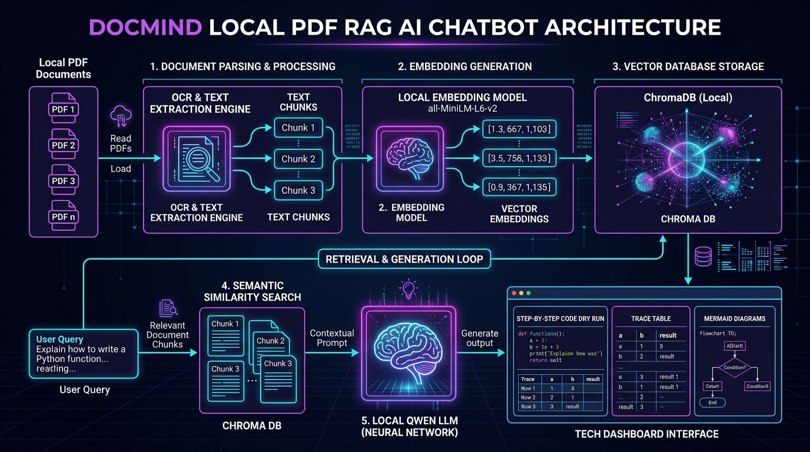
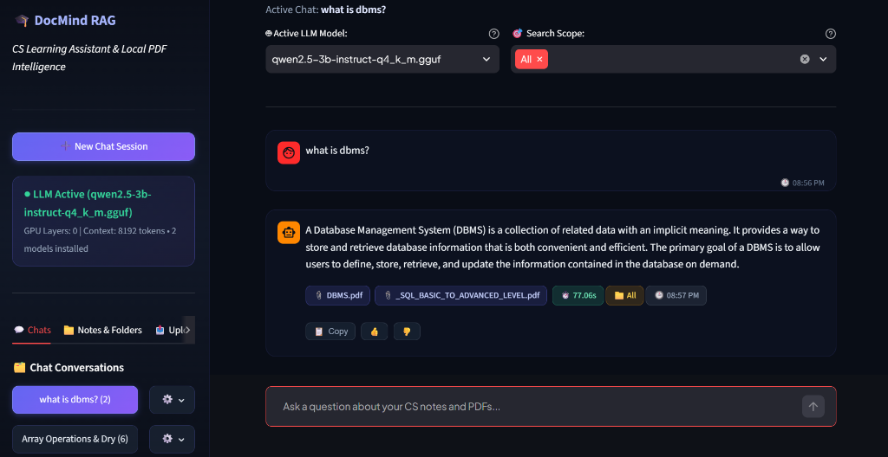
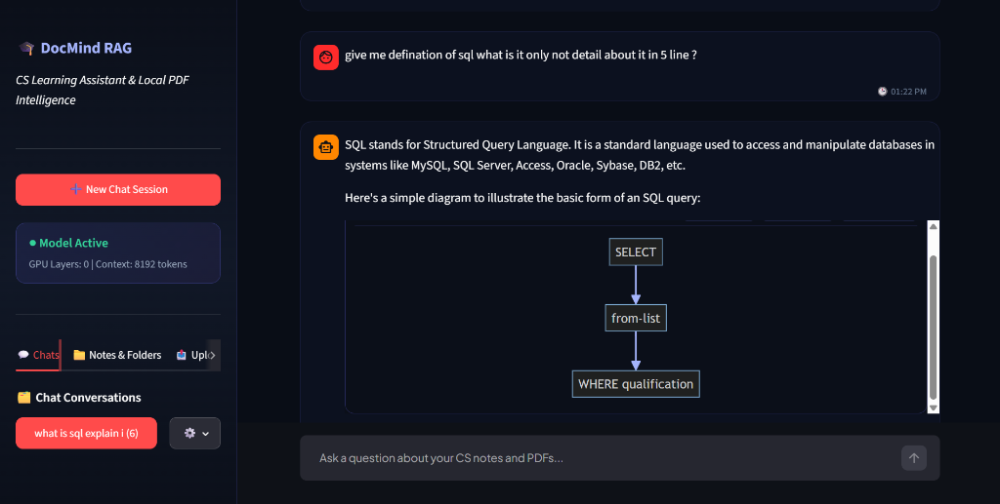
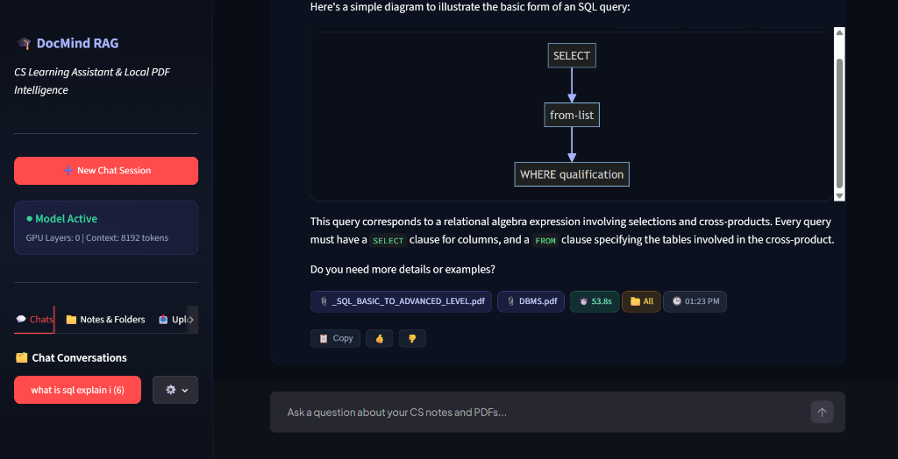
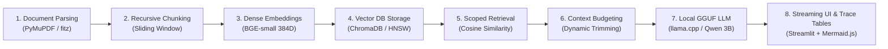
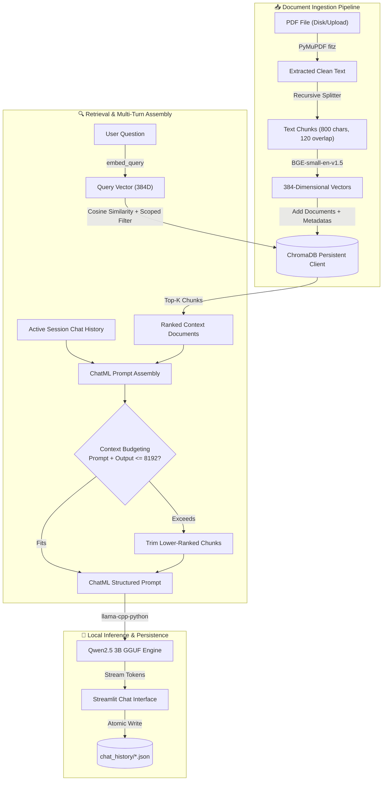
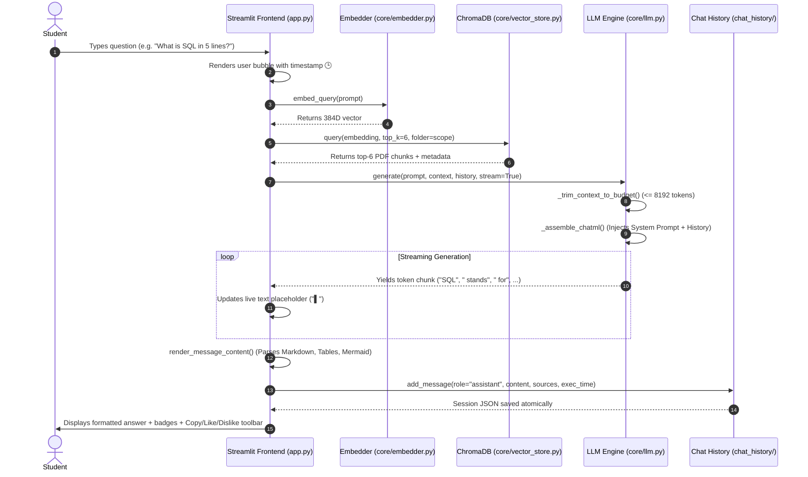

# DocMind RAG — Local PDF CS Learning Assistant & Code Tracing Engine

[](https://www.python.org/)
[](https://streamlit.io/)
[](https://www.trychroma.com/)
[](https://huggingface.co/Qwen)
[](https://pymupdf.readthedocs.io/)
[](LICENSE)

> **DocMind RAG** is a 100% private, offline, zero-API-cost **Retrieval-Augmented Generation (RAG)** educational mentor engineered for Computer Science, Engineering, and Science students. It transforms your local PDF lecture slides, handwritten notes, and textbooks into an interactive, syllabus-grounded AI assistant capable of proportionate marks-based answers, step-by-step code dry runs, memory visualization, and exportable Mermaid diagrams.

---

## 🏛️ System Architecture Overview



---

## 📸 Live Interface & Key Capabilities

### 1. Main Learning Dashboard & Multi-Folder Scoping
The frontend features a modern glassmorphism UI with multi-session chat persistence, subject-based folder filtering, real-time token streaming, and system telemetry:



### 2. Marks-Based Q&A with Live Interactive Diagrams
DocMind automatically adapts explanation depth to question intent—giving crisp 1–5 line answers for short queries while rendering interactive, zoomable **Mermaid.js flowcharts**:



### 3. Source Grounding, Timestamps & Action Toolbar
Every assistant response cites its exact PDF sources and includes generation latency, message timestamps, and zero-reload action controls (📋 Copy, 👍 Like, 👎 Dislike):



---

## 📚 Core CS & AI Concepts Learned From This Project

Building and running DocMind RAG teaches fundamental concepts across Artificial Intelligence, Information Retrieval, Natural Language Processing, and Systems Engineering:



### 1. Retrieval-Augmented Generation (RAG) vs. Vanilla LLMs
- **The Problem with Raw LLMs**: Standard LLMs hallucinate, lack private syllabus context, and cannot reference your university slides.
- **The RAG Solution**: RAG decouples *knowledge storage* (vector database) from *reasoning* (the LLM). Relevant excerpts from your notes are dynamically retrieved and injected into the prompt, grounding every answer in your actual study material.

### 2. Dense Vector Embeddings (BGE-small-en-v1.5)
- **Text to Geometry**: The embedding model maps sentences into a **384-dimensional continuous vector space**.
- **Semantic Proximity**: Semantically related queries and chunks have high **Cosine Similarity**:
  $$\text{Similarity}(u, v) = \frac{u \cdot v}{\|u\| \|v\|}$$

### 3. Recursive Chunking & Overlap Window
- **Token Constraints**: We partition extracted text into **800-character chunks with 120-character overlap**.
- **Sliding Overlap**: Guarantees that formulas, definitions, and code blocks split across chunk boundaries do not lose context.

### 4. Vector Database & Folder-Scoped Indexing (ChromaDB)
- **HNSW Indexing**: ChromaDB indexes embeddings using Hierarchical Navigable Small World graphs for sub-millisecond retrieval.
- **Folder Scoping**: Metadata tags (`source`, `folder`, `chunk_index`) allow filtering queries to specific subjects (e.g. `OS` or `DBMS` or `All`).

### 5. Local LLM Quantization & Context Length Budgeting (GGUF & llama.cpp)
- **4-Bit Quantization (`Q4_K_M`)**: Compresses Qwen2.5 3B from ~6 GB to ~2.1 GB, running on standard consumer CPUs without requiring a dedicated GPU.
- **Context Length (`N_CTX = 8192`)**: Provides full headroom for System Prompt (~480 tokens) + Retrieved Context (~1,200 tokens) + Multi-Turn History (~1,000 tokens) + Generation (~2,048 tokens), eliminating mid-sentence truncation.

---

## 📂 Project Directory Structure

```text
RAG PDF CHATBOT/
├── app.py                      # Streamlit Frontend (Chat UI, Notes Explorer, Diagram Exporter)
├── config.py                   # System parameters, N_CTX=8192, and optimized System Prompt
├── download_model.py           # Auto-downloader for Qwen2.5 3B GGUF model
├── run.py                      # One-click launcher script
├── requirements.txt            # Python package dependencies
├── .env                        # Local runtime environment settings (never committed)
├── .env.example                # Configuration template
├── assets/                     # Architectural infographics & UI screenshots
│   ├── docmind_rag_overview.png
│   ├── frontend_ui.png
│   ├── live_diagram_chat.png
│   ├── source_citations_actions.png
│   └── ui_dry_run_workflow.png
├── chat_history/               # Persistent JSON chat sessions on disk
│   └── chat_*.json
├── chroma_db/                  # Persistent ChromaDB vector store directory
├── core/                       # Backend RAG engine modules
│   ├── __init__.py             # Package initializer
│   ├── pdf_loader.py           # PyMuPDF (fitz) text & page extractor
│   ├── chunker.py              # RecursiveCharacterTextSplitter chunking logic
│   ├── embedder.py             # BGE-small-en-v1.5 embedding generator
│   ├── vector_store.py         # ChromaDB client, folder scoping & similarity search
│   ├── llm.py                  # llama-cpp-python inference, ChatML builder & context budgeting
│   └── chat_manager.py         # Multi-session disk persistence (create, pin, rename, delete)
├── models/                     # GGUF model storage (qwen2.5-3b-instruct-q4_k_m.gguf)
└── pdfs/                       # Uploaded PDF documents organized by category folder
    ├── General/
    ├── OS/
    └── DBMS/
```

---

## 🖥️ How the Frontend Works

The frontend is built with **Streamlit** and augmented with custom **HTML5/CSS3 glassmorphism design** and **interactive JavaScript components**:

1. **Sidebar Control Hub**:
   - **Chat Conversations Tab**: Manage multi-turn sessions, pin important topics, rename chats, or delete logs.
   - **Notes & Folders Explorer**: Inspect folder hierarchies, document counts, chunk statistics, and remove individual files.
   - **Upload Ingestion Tab**: Upload multi-page PDF documents into category folders with real-time progress indicators.
   - **System Status Card**: Real-time telemetry displaying model state, GPU layer offloading, and context size (`8192 tokens`).
2. **Search Scope Selector**:
   - Dynamic multiselect allowing searches across `"All"` documents or scoped to specific subjects (e.g. `OS` + `DBMS`).
3. **Real-Time Token Streaming**:
   - Streams response tokens in real-time with an animated cursor (`▌`) for zero perceived latency.
4. **Message Action Bar & Timestamps**:
   - 📋 **Copy**: Direct clipboard copy with instant visual confirmation (`Copied!`).
   - 👍 **Like** & 👎 **Dislike**: Feedback rating buttons for student evaluation.
   - 🕒 **Timestamps**: Real-time display of message delivery time (`🕒 01:23 PM`).
   - 📎 **Metadata Badges**: Cites source document names, retrieval folder scopes, and generation latency (`⏱️ 0.8s`).
5. **Interactive Mermaid.js Diagram Engine**:
   - Renders live architectural and algorithmic flowcharts with direct export:
     - 💾 **Save PNG**: High-resolution 2x DPI canvas export to downloads.
     - 📥 **Save SVG**: Lossless vector graphic export.
     - 📋 **Copy Code**: One-click Mermaid syntax copying.

---

## ⚙️ How the Backend & Database Work



### 1. Document Extraction (`core/pdf_loader.py`)
- Powered by **PyMuPDF (`fitz`)**, extracting text from multi-column layouts, tables, and slides at up to 10x the speed of traditional parsers.

### 2. Chunking Engine (`core/chunker.py`)
- Uses LangChain's `RecursiveCharacterTextSplitter` splitting on natural paragraph and sentence boundaries.

### 3. Embedding Pipeline (`core/embedder.py`)
- Uses **BGE-small-en-v1.5** via `sentence-transformers`. Queries are automatically prepended with `Represent this sentence: ` for optimal retrieval accuracy.

### 4. ChromaDB Vector Store (`core/vector_store.py`)
- Persists document vectors in `chroma_db/`. Queries execute with metadata filters:
  ```python
  # Single folder filter
  {"folder": "OS"}
  # Multi-folder filter
  {"$or": [{"folder": "OS"}, {"folder": "DBMS"}]}
  ```

### 5. LLM Engine & Context Budgeting (`core/llm.py`)
- **Dynamic Context Budgeting (`_trim_context_to_budget`)**: Computes exact prompt token counts against `N_CTX = 8192`. If context chunks exceed the safe generation threshold, lower-ranking chunks are automatically trimmed from the bottom, safeguarding **2,048 tokens** of generation space.

### 6. Multi-Turn Session Manager (`core/chat_manager.py`)
- Persists conversations as clean JSON files in `chat_history/` using atomic writes (`temp_path` -> `os.replace`), preventing corrupted chat logs.

---

## 🔄 Lifecycle of a Reply: Query Execution Sequence



---

## 🔬 The Dry Run & Code Tracing Protocol

When asking DocMind to trace code or explain an algorithm with a dry run, the system prompt activates a structured **6-stage pedagogy**:

| Stage | What DocMind Produces |
|:---|:---|
| **1. Concept & Intuition** | Clear explanation of the underlying algorithm/data structure. |
| **2. Implementation Code** | Clean, well-commented code in the target language (C, Python, C++, Java). |
| **3. Sample Input & Initial State** | Concrete starting values (e.g., `arr = [10, 20, 30]`, `top = -1`, `size = 5`). |
| **4. Step-by-Step Trace Table** | Exhaustive Markdown table tracking `Step #`, `Line/Op`, `Variables (Before -> After)`, `Condition`, `Memory/Stack State`, and `Output`. |
| **5. Visual Transition** | ASCII state diagram or interactive Mermaid flowchart showing memory shifts. |
| **6. Edge Cases & Complexity** | Analysis of boundary conditions (overflow/underflow) + Time $O(T)$ and Space $O(S)$ complexities. |

### Example Trace Table Format Generated:
```markdown
| Step # | Line / Operation | Variables State (Before -> After) | Condition Evaluated | Stack / Memory State | Output / Effect |
|--------|------------------|-----------------------------------|---------------------|----------------------|-----------------|
| 1      | `stack = createStack(5)` | `top = -1, capacity = 5` | N/A | `[ ]` (empty) | Stack initialized |
| 2      | `push(stack, 10)` | `top: -1 -> 0, array[0] = 10` | `top < capacity - 1` (True) | `[10]` | 10 pushed to stack |
| 3      | `push(stack, 20)` | `top: 0 -> 1, array[1] = 20` | `top < capacity - 1` (True) | `[10, 20]` | 20 pushed to stack |
| 4      | `pop(stack)` | `top: 1 -> 0, return 20` | `isEmpty()` (False) | `[10]` | 20 popped from stack |
```

---

## 🚀 Getting Started & Setup Guide

### 1. Prerequisites
- **Python**: Version 3.10, 3.11, or 3.12 installed.
- **Windows PowerShell** or Linux/macOS terminal.

### 2. Environment Setup
```powershell
# Navigate to project directory
cd "c:\Users\LENOVO\Desktop\python\learning chatbot\RAG PDF CHATBOT"

# Create virtual environment
python -m venv .venv

# Activate virtual environment
.\.venv\Scripts\activate

# Upgrade pip and install dependencies
.\.venv\Scripts\python.exe -m pip install --upgrade pip
.\.venv\Scripts\pip.exe install -r requirements.txt
```

### 3. Model Download
Download the quantized **Qwen2.5 3B Instruct** GGUF model (~2.1 GB) into the `models/` directory:

```powershell
# Recommended: Run built-in downloader script
.\.venv\Scripts\python.exe download_model.py
```

*Alternative direct download with `curl.exe`:*
```powershell
curl.exe -L -o models/qwen2.5-3b-instruct-q4_k_m.gguf "https://huggingface.co/Qwen/Qwen2.5-3B-Instruct-GGUF/resolve/main/qwen2.5-3b-instruct-q4_k_m.gguf"
```

### 4. Configuration Setup
Create your `.env` configuration file:
```powershell
copy .env.example .env
```

Contents of `.env`:
```env
MODEL_PATH=models/qwen2.5-3b-instruct-q4_k_m.gguf
N_GPU_LAYERS=0
N_CTX=8192
MAX_TOKENS=2048
N_BATCH=512
N_THREADS=0
```

### 5. Launch Application
```powershell
.\.venv\Scripts\python.exe -m streamlit run app.py
```
Open your browser and navigate to:
```
http://localhost:8501
```

---

## ⚡ Performance Optimization & GPU Acceleration (Optional)

If your system has an **NVIDIA GPU** with CUDA installed:

```powershell
# Uninstall CPU build of llama-cpp-python
.\.venv\Scripts\pip.exe uninstall llama-cpp-python -y

# Reinstall with CUDA support
$env:CMAKE_ARGS="-DGGML_CUDA=on"
.\.venv\Scripts\pip.exe install llama-cpp-python --no-cache-dir
```

Then edit `.env` to offload all layers to your GPU:
```env
N_GPU_LAYERS=-1
```

---

## 📄 License

This project is open-source and licensed under the [MIT License](LICENSE).
