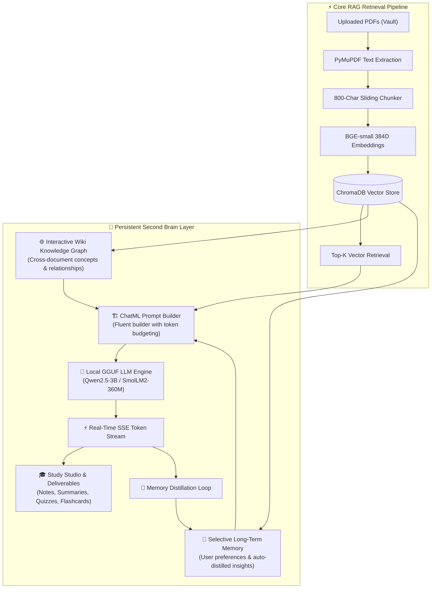

# DocMind RAG + Second Brain

[](https://www.python.org/)
[](https://react.dev/)
[](https://fastapi.tiangolo.com/)
[](https://www.trychroma.com/)
[](https://huggingface.co/)
[](LICENSE)

> **DocMind RAG + Second Brain** is an AI-powered document intelligence assistant and personal knowledge synthesizer. It turns your PDF lecture slides, handwritten notes, research papers, and technical books into an interconnected, syllabus-grounded learning ecosystem.
>
> **100% Local & Offline • Zero External API Keys • Zero Cloud Telemetry • 100% Private & Free**

---

## ⚡ Quick Start & One-Click Deployment

DocMind features a **unified single-port deployment**: both the React 18 production frontend and the FastAPI v1 backend are served together on **port 8000**.

### 🚀 Launching the App
```powershell
# 1. Clone or navigate to the project directory
cd "RAG PDF CHATBOT"

# 2. Start the unified server (Windows, macOS, Linux)
python run.py

# Or on Windows, simply double-click:
start.bat
```
Open your browser to:
👉 **`http://localhost:8000`** (or `http://127.0.0.1:8000`)

---

## 🛠️ Complete Technology Stack

| Layer | Technologies Used | Role & Architectural Details |
| :--- | :--- | :--- |
| **Frontend UI** | **React 18**, **Vite 6**, **Lucide Icons** | Modern Glassmorphism dark theme, interactive SVG Wiki Knowledge Graph, token streaming (`fetch` SSE reader), multi-session management, and chat deletion controls. |
| **Design System** | **Vanilla CSS** (`frontend/src/index.css`) | Custom HSL design tokens, glass panels (`backdrop-filter`), micro-animations, responsive layout without bloated third-party CSS frameworks. |
| **Backend REST API** | **FastAPI**, **Starlette**, **Pydantic v2** | High-performance asynchronous API layer with dual trailing-slash routes, Server-Sent Events (SSE) token streaming, and SPA catch-all routing. |
| **Local LLM Engine** | **`llama-cpp-python`** (C++ ggml runtime) | Offline CPU/GPU GGUF inference (Qwen2.5-3B & SmolLM2-360M) with dynamic token budgeting and ChatML prompt assembly. |
| **Embeddings** | **`BAAI/bge-small-en-v1.5`** | 384-dimensional dense vector embeddings with instruction prefixes via `sentence-transformers`. |
| **Vector Database** | **ChromaDB** (`chroma_db/`) | Persistent vector storage utilizing Hierarchical Navigable Small World (HNSW) indexing and folder metadata filtering. |
| **Document Ingestion** | **PyMuPDF** (`fitz`), **LangChain Splitters** | High-speed PDF text and page extraction with 800-character recursive chunks and 120-character sliding overlaps. |
| **Relational Database** | **SQLite 3** (`WAL` mode) | Stores structured Wiki knowledge nodes, cross-document semantic edges, selective long-term memories, and study deliverables. |
| **Session Persistence** | **Atomic JSON Filesystem** (`chat_history/`) | Atomic file write-and-replace for conversational persistence, pin toggling, and instant session deletion. |

---

## 🧠 The Second Brain Architecture

Traditional RAG systems are **amnesic**: they run a cold vector search, feed raw text snippets to an LLM, and forget everything once the turn finishes.

**DocMind Second Brain** wraps the core RAG pipeline with **four persistent knowledge organs**:



---

## 🌐 Interactive Wiki Knowledge Graph (Visual Topic Linking)

One of DocMind's standout capabilities is the **Cross-Document Wiki Knowledge Graph**. Rather than viewing documents in isolated silos, DocMind mines concepts and establishes semantic links connecting topics across all your uploaded PDFs.

```
                   ┌────────────────────────┐
                   │        Deadlock        │
                   └───────────┬────────────┘
                               │
               ┌───────────────┴───────────────┐
       ──[requires]──>                 ──[detected_by]──>
               ▼                               ▼
  ┌─────────────────────────┐     ┌─────────────────────────┐
  │   Coffman Conditions    │     │      Banker's Algo      │
  └────────────┬────────────┘     └─────────────────────────┘
               │
        ──[includes]──>
               ▼
  ┌─────────────────────────┐
  │    Circular Wait        │
  └─────────────────────────┘
```

### How to Use the Wiki Graph:
1. Click **Wiki Graph** in the top navigation bar (or open the **Second Brain Hub** modal).
2. The interactive visual network renders every extracted concept as an orbital node with directional relationship edges (e.g. `requires`, `implements`, `subclass_of`, `related_to`).
3. **Interactive Click-to-Inspect**:
   - **Click any topic node**: The graph highlights the selected concept, illuminates all direct connections, and dims unrelated topics.
   - **Concept Inspector Drawer**: Displays the concept's canonical definition, category badge (`CONCEPT`, `ALGORITHM`, `DATA_STRUCTURE`), document source citations, and direct relationship links.
   - **Navigate the Web**: Click any linked neighbor tag in the inspector to jump straight to that concept in the graph!
4. **Mode Toggle**: Switch between **Visual Graph** and **Cards Grid** anytime.
5. **One-Click Mining**: If your graph is empty, click **Extract Concepts** to automatically mine definitions and cross-document links from your uploaded PDFs.

---

## 📐 Low-Level Design (LLD) & SOLID Design Patterns

DocMind RAG is structured following clean object-oriented architecture and recognized design patterns:

### 1. Repository Pattern (`SRP`, `DIP`)
- **Location**: [`backend/repositories/session_repository.py`](file:///c:/Users/LENOVO/Desktop/python/learning%20chatbot/RAG%20PDF%20CHATBOT/backend/repositories/session_repository.py)
- **Interface**: `BaseSessionRepository` defines `get_session()`, `list_sessions()`, `save_session()`, `delete_session()`, `create_session()`.
- **Implementation**: `FileSessionRepository` provides atomic, thread-safe JSON file persistence in `chat_history/`.
- **Benefit**: Route handlers and API routers do not touch files or path logic directly; storage mechanisms can be swapped (e.g. SQLite, PostgreSQL) with zero changes to business logic.

### 2. Strategy Pattern (`OCP`, `SRP`)
- **Location**: [`backend/output/strategies/`](file:///c:/Users/LENOVO/Desktop/python/learning%20chatbot/RAG%20PDF%20CHATBOT/backend/output/strategies/)
  - `base.py`: Abstract `DeliverableStrategy`
  - `study_notes.py`: `StudyNotesStrategy` (High-yield cheat sheets)
  - `summary.py`: `SummaryStrategy` (Executive summaries)
  - `quiz.py`: `QuizStrategy` (5-question practice exams with answer keys)
  - `flashcards.py`: `FlashcardsStrategy` (Active-recall flashcards)
- **Benefit**: Each deliverable format is an isolated strategy class responsible for prompt assembly and offline fallback generation.

### 3. Factory Pattern (`OCP`, `DIP`)
- **Location**: [`backend/output/strategies/factory.py`](file:///c:/Users/LENOVO/Desktop/python/learning%20chatbot/RAG%20PDF%20CHATBOT/backend/output/strategies/factory.py)
- **Implementation**: `DeliverableFactory` maintains a runtime registry of strategies and normalizes user aliases (`"notes"`, `"summary"`, `"quiz"`, `"flashcard"`).
- **Benefit**: Adding a new deliverable type (such as `MIND_MAP` or `FAQ`) requires only registering a new strategy without modifying existing generation code.

### 4. Builder Pattern (`SRP`)
- **Location**: [`backend/orchestration/prompt_builder.py`](file:///c:/Users/LENOVO/Desktop/python/learning%20chatbot/RAG%20PDF%20CHATBOT/backend/orchestration/prompt_builder.py)
- **Implementation**: `ChatMLPromptBuilder` provides a fluent chaining interface:
  ```python
  prompt = (
      ChatMLPromptBuilder()
      .set_system_instructions(SYSTEM_PROMPT)
      .add_rules(ANTI_HALLUCINATION_RULES)
      .add_memories(active_user_memories)
      .add_evidence(retrieved_pdf_chunks)
      .add_wiki_concepts(connected_concepts)
      .add_history(conversation_turns)
      .set_query(user_query)
      .build()
  )
  ```
- **Benefit**: Isolates ChatML formatting and token budgeting from API controllers.

### 5. Service Layer (`SRP`, `DIP`)
- **Location**: [`backend/services/chat_service.py`](file:///c:/Users/LENOVO/Desktop/python/learning%20chatbot/RAG%20PDF%20CHATBOT/backend/services/chat_service.py)
- **Implementation**: `ChatService` orchestrates session resolution, vector search, prompt building, LLM generation, and memory distillation.

---

## 🗑️ Chat Deletion Option

Users can delete past conversations anytime with full data cleanup:

1. In the sidebar under the **Chats** tab, hover over any conversation card.
2. Click the **red trash icon** on the right side of the card.
3. Confirm deletion in the prompt dialog.
4. **Backend Action**: The server atomically deletes the session file `chat_history/chat_<id>.json`.
5. **Frontend State**: The chat is removed from the sidebar list. If the active chat was deleted, the UI automatically transitions to the next conversation or opens a clean new chat.

---

## 📂 Project Directory Structure

```text
RAG PDF CHATBOT/
├── run.py                        # Single main unified launcher (Port 8000: React UI + FastAPI backend)
├── start.bat                     # Windows one-click double-clickable launcher
├── config.py                     # System hyperparameters, model paths, and context budgets
├── download_model.py             # Multi-model downloader helper (Qwen 3B, SmolLM2 360M)
├── requirements.txt              # Clean Python dependencies (100% offline, zero API keys)
│
├── backend/                      # Production FastAPI Backend Layer
│   ├── api/                      # REST API Endpoints
│   │   ├── main.py               # FastAPI App & SPA static mount
│   │   └── v1/
│   │       ├── chat.py           # Chat SSE streaming, history, and chat deletion routes
│   │       ├── documents.py      # PDF upload, listing, and deletion routes
│   │       ├── knowledge.py      # Wiki concepts, relationships, and mining routes
│   │       ├── memory.py         # Selective long-term memory CRUD routes
│   │       ├── models.py         # Dynamic model telemetry & switching routes
│   │       └── outputs.py        # Study deliverable generation routes
│   │
│   ├── database/                 # SQLite Relational Database Layer
│   │   ├── connection.py         # SQLite connection factory with WAL mode
│   │   ├── crud.py               # Database queries (memories, concepts, edges, artifacts)
│   │   └── models.py             # Pydantic data schemas
│   │
│   ├── knowledge/                # Wiki Knowledge Graph Engine
│   │   ├── concept_miner.py      # Concept extraction from text
│   │   ├── graph_service.py      # Graph serialization & prompt injection
│   │   └── relationship_builder.py# Semantic relation link builder
│   │
│   ├── memory/                   # Selective Long-Term Memory Engine
│   │   ├── memory_evaluator.py   # Post-turn memory distillation
│   │   └── memory_manager.py     # Memory retrieval & scoring
│   │
│   ├── orchestration/            # Prompt & Context Assembly
│   │   ├── budget_controller.py  # Dynamic token budgeting
│   │   ├── context_assembler.py  # Multi-layer context unification
│   │   └── prompt_builder.py     # Builder Pattern for ChatML formatting
│   │
│   ├── output/                   # Deliverables Engine (SOLID Patterns)
│   │   ├── generator.py          # Deliverable generation orchestrator
│   │   └── strategies/           # Strategy & Factory pattern implementations
│   │       ├── base.py           # DeliverableStrategy abstract base
│   │       ├── factory.py        # DeliverableFactory registry
│   │       ├── flashcards.py     # FlashcardsStrategy
│   │       ├── quiz.py           # QuizStrategy
│   │       ├── study_notes.py    # StudyNotesStrategy
│   │       └── summary.py        # SummaryStrategy
│   │
│   ├── repositories/             # Repository Pattern Layer
│   │   └── session_repository.py # FileSessionRepository (atomic session CRUD)
│   │
│   └── services/                 # Domain Service Layer
│       └── chat_service.py       # Core chat orchestration service
│
├── core/                         # Core Local RAG Pipeline
│   ├── chunker.py                # Recursive sliding chunker (800 chars / 120 overlap)
│   ├── embedder.py               # BGE-small-en-v1.5 dense vector embedder
│   ├── llm.py                    # llama-cpp-python GGUF inference & streaming
│   ├── pdf_loader.py             # PyMuPDF text & page extraction
│   └── vector_store.py           # ChromaDB client & similarity search
│
├── frontend/                     # React 18 Production Frontend
│   ├── dist/                     # Pre-built production bundle (served at :8000)
│   ├── src/
│   │   ├── api.js                # API client with SSE stream parser & error handling
│   │   ├── App.jsx               # Main React state container & layout
│   │   ├── index.css             # Glassmorphism design system & CSS variables
│   │   └── components/
│   │       ├── ChatView.jsx      # Streaming chat view, citations, action buttons
│   │       ├── Header.jsx        # App header, health badge, model switcher
│   │       ├── SecondBrainModal.jsx# Second Brain hub (Memory, Wiki Graph, Studio)
│   │       ├── Sidebar.jsx       # Sidebar with chat deletion, vault, and config
│   │       └── WikiGraphVisualizer.jsx # Interactive SVG Knowledge Graph
│   ├── package.json              # Frontend package configuration
│   └── vite.config.js            # Vite build & proxy settings
│
├── tests/                        # Automated Test Suite (19/19 Passing)
│   ├── test_api.py               # API routes, deletion lifecycle, and SOLID patterns
│   └── test_second_brain.py      # Vector search, SQLite CRUD, and memory evaluation
│
├── chat_history/                 # Atomic JSON session files
├── chroma_db/                    # ChromaDB vector index directory
├── models/                       # GGUF model files (Qwen2.5-3B, SmolLM2-360M)
└── pdfs/                         # User PDF storage organized by collections
```

---

## 🤖 Supported Local LLM Models

| Metric / Feature | SmolLM2-360M-Instruct | Qwen2.5-3B-Instruct (Recommended) |
| :--- | :--- | :--- |
| **Model File** | `SmolLM2-360M-Instruct-Q4_K_M.gguf` | `qwen2.5-3b-instruct-q4_k_m.gguf` |
| **Quantization** | 4-bit (`Q4_K_M`) | 4-bit (`Q4_K_M`) |
| **Disk Size** | **~258 MB** | **~2.0 GB** |
| **RAM Footprint** | **~350 MB** | **~3.2 GB** |
| **CPU Latency** | ⚡ **< 0.2s** (Ultra-fast) | 🚀 **~1.0s** (Fast) |
| **Best Used For** | Low-spec laptops, quick factual lookups | Deep reasoning, dry runs, algorithms, flowcharts |

### Download Models:
```powershell
# Interactive downloader:
python download_model.py
```

---

## 🧪 Automated Testing

DocMind includes automated unit and integration tests covering the API, chat deletion, SOLID strategy factory, prompt builder, vector store, and SQLite database:

```powershell
# Run the complete test suite:
python -m unittest discover tests
```

**Results**:
```text
Ran 19 tests in 105.651s
OK (All 19 tests passed)
```

---

## 📄 License

DocMind RAG is open-source software licensed under the [MIT License](LICENSE).
