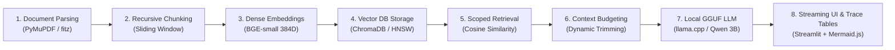
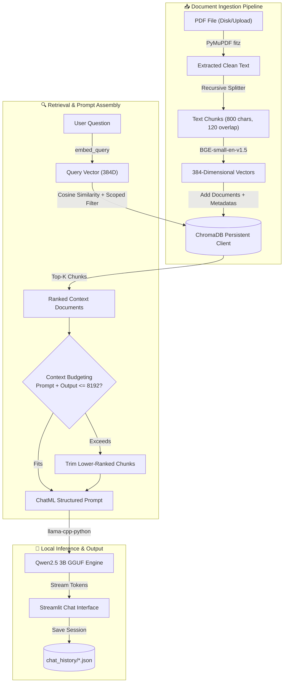
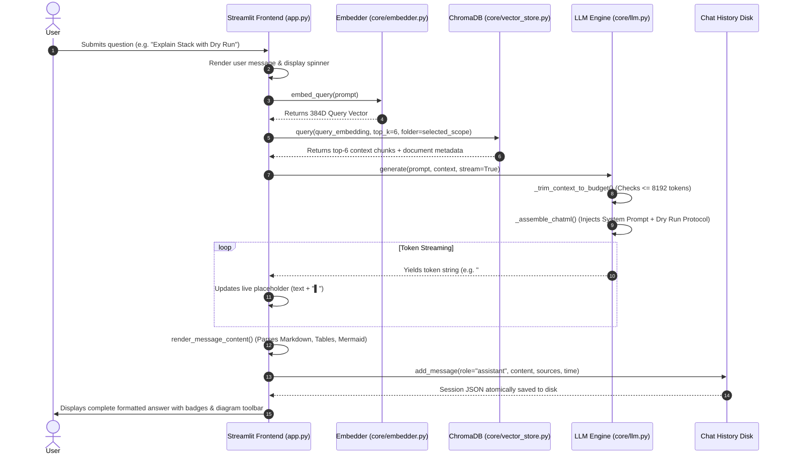

# DocMind RAG — Local PDF CS Learning Assistant & Code Tracing Engine

[](https://www.python.org/)
[](https://streamlit.io/)
[](https://www.trychroma.com/)
[](https://huggingface.co/Qwen)
[](https://pymupdf.readthedocs.io/)
[](LICENSE)

> **DocMind RAG** is a 100% private, fully offline, zero-API-key **Retrieval-Augmented Generation (RAG)** educational assistant designed for Computer Science, Engineering, and Science students. It transforms your local PDF textbooks, lecture slides, and notes into an interactive, grounded AI mentor capable of in-depth explanations, complete code dry runs with step-by-step trace tables, memory visualization, and exportable Mermaid diagrams.

---

## 🏛️ System Architecture Overview


---

## 📚 What We Learn From This Project (Core CS & AI Concepts)

Building and understanding DocMind RAG teaches fundamental concepts across modern Artificial Intelligence, Systems Programming, Information Retrieval, and Full-Stack Engineering:



### 1. Retrieval-Augmented Generation (RAG) vs. Pure LLMs
- **The Problem with Raw LLMs**: Standard Large Language Models suffer from hallucinations, lack private syllabus context, and cannot reference your specific university slides or PDFs.
- **The RAG Solution**: RAG separates *knowledge storage* (vector database) from *reasoning* (the LLM). Relevant excerpts from your notes are dynamically fetched and injected into the prompt, grounding every answer in your actual study material.

### 2. Dense Vector Embeddings & High-Dimensional Semantic Spaces
- **Text to Geometry**: The `BAAI/bge-small-en-v1.5` transformer model projects arbitrary sentences into a **384-dimensional dense vector space**.
- **Semantic Proximity**: Sentences with similar meanings (e.g. `"LIFO data structure"` and `"Stack push and pop operations"`) are placed close to each other in vector space, measured using **Cosine Similarity**:
  $$\text{Similarity}(u, v) = \frac{u \cdot v}{\|u\| \|v\|}$$

### 3. Text Chunking & Context Window Strategies
- **Window Constraints**: Embedding models and LLMs have finite context limits. We split raw PDF text into discrete **800-character chunks with 120-character overlap**.
- **Sliding Overlap**: The overlap guarantees that sentences or code blocks split across chunk boundaries maintain contextual continuity and do not lose semantic meaning.

### 4. Vector Databases & Metadata-Scoped Indexing (ChromaDB)
- **HNSW Indexing**: ChromaDB uses Hierarchical Navigable Small World (HNSW) graphs to perform approximate nearest-neighbor searches in sub-millisecond time.
- **Folder Scoping**: Chunks are stored with structured metadata (`source`, `folder`, `chunk_index`), enabling users to restrict searches to specific subjects (e.g., searching only within the `OS` folder or across `All` folders).

### 5. Local LLM Quantization & Context Length Budgeting (GGUF & llama.cpp)
- **4-Bit GGUF Quantization (`Q4_K_M`)**: Compresses the 3-billion parameter Qwen2.5 model from ~6 GB down to ~2.1 GB, allowing real-time CPU execution without expensive GPU VRAM.
- **Context Length Management (`N_CTX = 8192`)**: Ensures sufficient headroom for the system prompt (~848 tokens) + retrieved PDF context (~1,200 tokens) + full output generation (~2,048 tokens), completely preventing mid-sentence truncation.

### 6. Rigorous Dry Runs & Algorithmic Tracing
- **Step-by-Step Trace Tables**: Translates abstract code into concrete execution tables tracking line numbers, variable states (`Before -> After`), conditions evaluated, and stack/array memory transitions.

---

## 📂 Project Directory Structure

```text
RAG PDF CHATBOT/
├── app.py                      # Streamlit Frontend (Chat UI, Notes Explorer, Diagram Exporter)
├── config.py                   # Global system parameters, N_CTX=8192, and System Prompt
├── download_model.py           # Auto-downloader for Qwen2.5 3B GGUF model
├── run.py                      # One-click launcher script
├── requirements.txt            # Python package dependencies
├── .env                        # Local runtime environment settings
├── .env.example                # Configuration template
├── assets/                     # Architectural infographics & UI diagrams
│   ├── docmind_rag_overview.png
│   └── ui_dry_run_workflow.png
├── chat_history/               # Persistent JSON chat sessions on disk
│   └── chat_*.json
├── chroma_db/                  # Persistent ChromaDB vector store directory
├── core/                       # Backend RAG engine modules
│   ├── __init__.py             # Package initializer
│   ├── pdf_loader.py           # PyMuPDF (fitz) text & page extractor
│   ├── chunker.py              # RecursiveCharacterTextSplitter chunking logic
│   ├── embedder.py             # BGE-small-en-v1.5 embedding generator
│   ├── vector_store.py         # ChromaDB client, folder scoping & similarity search
│   ├── llm.py                  # llama-cpp-python inference, ChatML builder & context budgeting
│   └── chat_manager.py         # Multi-session disk persistence (create, pin, rename, delete)
├── models/                     # GGUF model storage (qwen2.5-3b-instruct-q4_k_m.gguf)
└── pdfs/                       # Uploaded PDF documents organized by category folder
    ├── General/
    ├── OS/
    └── DBMS/
```

---

## 🖥️ How the Frontend Works


The frontend is built with **Streamlit** and augmented with custom **HTML5/CSS3 glassmorphism design** and **interactive JavaScript components**:

1. **Sidebar Control Hub**:
   - **Chat Management Tab**: Lists all persistent chat conversations with message counters, pin/unpin toggles, renaming popovers, and deletion controls.
   - **Notes & Folders Explorer**: Displays folder hierarchy, document counts, chunk statistics, and individual document deletion.
   - **Upload Ingestion Tab**: Allows uploading multi-page PDF documents into custom or default folders with real-time progress bars.
   - **System Status Card**: Displays active model status, context window size (`8192 tokens`), and GPU layer offloading status.
2. **Search Scope Selector**:
   - Dynamic multiselect dropdown allowing queries across `"All"` documents or scoped to specific subjects (e.g. `OS` + `DBMS`).
3. **Real-Time Token Streaming**:
   - Utilizes Python generator streaming to render response tokens in real-time with an animated cursor (`▌`), avoiding long waiting times.
4. **Message Action Bar & Timestamps**:
   - 📋 **Copy**: Direct clipboard copy with instant visual feedback (`Copied!`).
   - 👍 **Like** & 👎 **Dislike**: Instant feedback rating on assistant explanations.
   - 🕒 **Timestamps**: Real-time display of message delivery time (e.g., `🕒 12:18 PM`).
   - 📎 **Metadata Badges**: Cites source document names, retrieval folder scopes, and generation latency (`⏱️ 0.8s`).
5. **Interactive Mermaid.js Diagram Engine**:
   - Auto-detects and sanitizes LLM-generated Mermaid diagrams.
   - Embeds a custom HTML5 canvas component featuring:
     - 💾 **Save PNG**: High-resolution 2x DPI canvas export directly to local downloads.
     - 📥 **Save SVG**: Lossless vector graphic download.
     - 📋 **Copy Code**: One-click Mermaid syntax copying to clipboard.

---

## ⚙️ How the Backend & Database Work



### 1. Text Extraction (`core/pdf_loader.py`)
- Powered by **PyMuPDF (`fitz`)**, which extracts text from complex multi-column layouts, tables, and formatted slides significantly faster than standard PDF parsers.

### 2. Chunking Engine (`core/chunker.py`)
- Employs LangChain's `RecursiveCharacterTextSplitter` splitting on natural boundaries (`\n\n`, `\n`, `. `, ` `, `""`) to preserve semantic coherence.

### 3. Embedding Pipeline (`core/embedder.py`)
- Uses **BGE-small-en-v1.5** via `sentence-transformers`.
- Queries automatically receive the instruction prefix `Represent this sentence: ` to optimize the dense retrieval representation.

### 4. ChromaDB Vector Store (`core/vector_store.py`)
- Stores documents persistently in `chroma_db/`.
- Queries apply metadata filters:
  ```python
  # Single folder filter
  {"folder": "OS"}
  # Multi-folder filter
  {"$or": [{"folder": "OS"}, {"folder": "DBMS"}]}
  ```

### 5. LLM Engine & Context Budgeting (`core/llm.py`)
- Loads the GGUF model via `llama-cpp-python`.
- **Dynamic Context Budgeting (`_trim_context_to_budget`)**:
  Calculates exact prompt token count against `N_CTX = 8192`. If context chunks exceed the safe generation threshold, lower-ranking chunks are automatically trimmed from the bottom, guaranteeing **2,048 tokens** of generation space.

### 6. Persistent Chat Manager (`core/chat_manager.py`)
- Persists conversations as clean JSON files in `chat_history/` with atomic write operations (`temp_path` -> `os.replace`), preventing corrupted chat logs on unexpected terminations.

---

## 🔄 Lifecycle of a Reply: How Each Query & Response Works



---

## 🔬 The Dry Run & Code Tracing Protocol

When asking DocMind to trace code or explain an algorithm with a dry run, the system prompt activates a structured **6-stage pedagogy**:

| Stage | What DocMind Produces |
|:---|:---|
| **1. Concept & Intuition** | Clear explanation of the underlying algorithm/data structure. |
| **2. Implementation Code** | Clean, well-commented code in the target language (C, Python, C++, Java). |
| **3. Sample Input & Initial State** | Concrete starting values (e.g., `arr = [10, 20, 30]`, `top = -1`, `size = 5`). |
| **4. Step-by-Step Trace Table** | Exhaustive Markdown table tracking `Step #`, `Line/Op`, `Variables (Before -> After)`, `Condition`, `Memory/Stack State`, and `Output`. |
| **5. Visual Transition** | ASCII state diagram or interactive Mermaid flowchart showing memory shifts. |
| **6. Edge Cases & Complexity** | Analysis of boundary conditions (overflow/underflow) + Time $O(T)$ and Space $O(S)$ complexities. |

### Example Trace Table Format Generated:
```markdown
| Step # | Line / Operation | Variables State (Before -> After) | Condition Evaluated | Stack / Memory State | Output / Effect |
|--------|------------------|-----------------------------------|---------------------|----------------------|-----------------|
| 1      | `stack = createStack(5)` | `top = -1, capacity = 5` | N/A | `[ ]` (empty) | Stack initialized |
| 2      | `push(stack, 10)` | `top: -1 -> 0, array[0] = 10` | `top < capacity - 1` (True) | `[10]` | 10 pushed to stack |
| 3      | `push(stack, 20)` | `top: 0 -> 1, array[1] = 20` | `top < capacity - 1` (True) | `[10, 20]` | 20 pushed to stack |
| 4      | `pop(stack)` | `top: 1 -> 0, return 20` | `isEmpty()` (False) | `[10]` | 20 popped from stack |
```

---

## 🚀 Getting Started & Setup Guide

### 1. Prerequisites
- **Python**: Version 3.10, 3.11, or 3.12 installed.
- **Windows PowerShell** or Linux/macOS terminal.

### 2. Environment Setup
```powershell
# Navigate to project directory
cd "c:\Users\LENOVO\Desktop\python\learning chatbot\RAG PDF CHATBOT"

# Create virtual environment
python -m venv .venv

# Activate virtual environment
.\.venv\Scripts\activate

# Upgrade pip and install dependencies
.\.venv\Scripts\python.exe -m pip install --upgrade pip
.\.venv\Scripts\pip.exe install -r requirements.txt
```

### 3. Model Download
Download the quantized **Qwen2.5 3B Instruct** GGUF model (~2.1 GB) into the `models/` directory:

```powershell
# Recommended: Run built-in downloader script
.\.venv\Scripts\python.exe download_model.py
```

*Alternative direct download with `curl.exe`:*
```powershell
curl.exe -L -o models/qwen2.5-3b-instruct-q4_k_m.gguf "https://huggingface.co/Qwen/Qwen2.5-3B-Instruct-GGUF/resolve/main/qwen2.5-3b-instruct-q4_k_m.gguf"
```

### 4. Configuration Setup
Create your `.env` configuration file:
```powershell
copy .env.example .env
```

Contents of `.env`:
```env
MODEL_PATH=models/qwen2.5-3b-instruct-q4_k_m.gguf
N_GPU_LAYERS=0
N_CTX=8192
MAX_TOKENS=2048
N_BATCH=512
N_THREADS=0
```

### 5. Launch Application
```powershell
.\.venv\Scripts\python.exe -m streamlit run app.py
```
Open your browser and navigate to:
```
http://localhost:8501
```

---

## ⚡ Performance Optimization & GPU Acceleration (Optional)

If your system has an **NVIDIA GPU** with CUDA installed:

```powershell
# Uninstall CPU build of llama-cpp-python
.\.venv\Scripts\pip.exe uninstall llama-cpp-python -y

# Reinstall with CUDA support
$env:CMAKE_ARGS="-DGGML_CUDA=on"
.\.venv\Scripts\pip.exe install llama-cpp-python --no-cache-dir
```

Then edit `.env` to offload all layers to your GPU:
```env
N_GPU_LAYERS=-1
```

---

## 📄 License

This project is open-source and licensed under the [MIT License](LICENSE).
