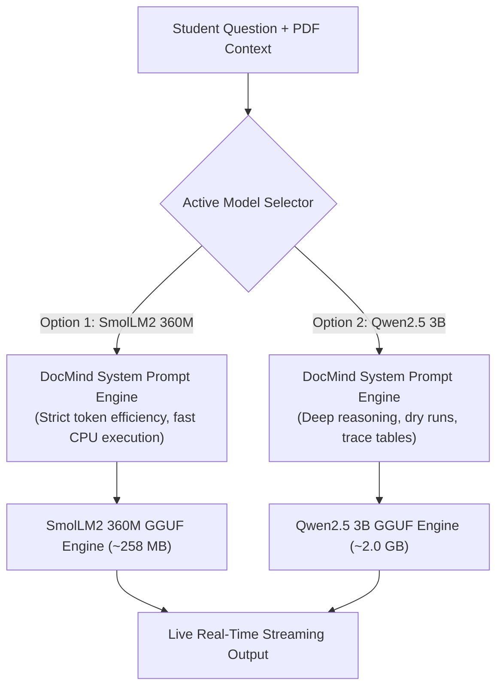
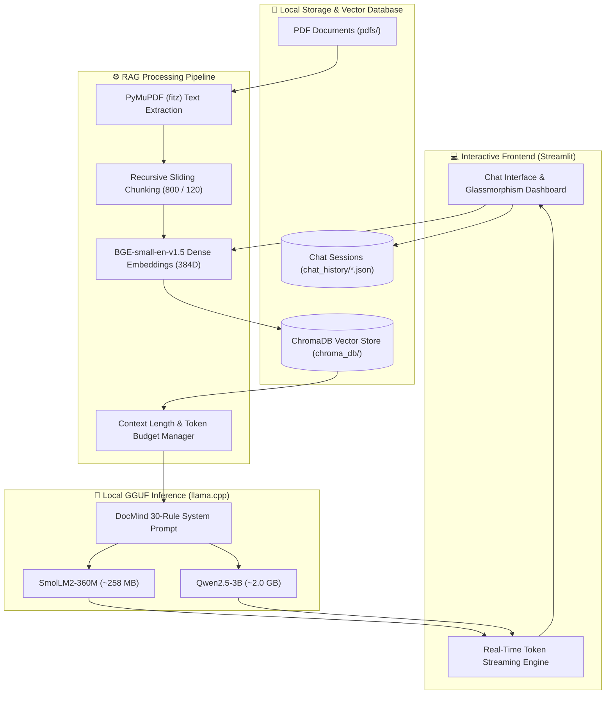

# DocMind RAG — Local PDF CS Learning Assistant & Code Tracing Engine

[](https://www.python.org/)
[](https://streamlit.io/)
[](https://www.trychroma.com/)
[](https://huggingface.co/)
[](https://pymupdf.readthedocs.io/)
[](LICENSE)

> **DocMind RAG** is a 100% private, offline, zero-API-cost **Retrieval-Augmented Generation (RAG)** educational assistant engineered for Computer Science, Engineering, and Science students. It transforms your local PDF lecture slides, handwritten notes, and textbooks into an interactive, syllabus-grounded AI mentor with strict question-adherence, step-by-step code dry runs, marks-based exam answers, memory visualization, and exportable Mermaid diagrams.

---

## ⚡ Quick Summary & Model Specifications

| Component | Specification / Details |
| :--- | :--- |
| **Supported LLMs** | **[1] HuggingFaceTB/SmolLM2-360M-Instruct** (~258 MB) • **[2] Qwen/Qwen2.5-3B-Instruct** (~2.0 GB) |
| **Model Format** | **GGUF** (4-bit quantization, local offline execution) |
| **Inference Engine** | Direct local Python execution via **`llama-cpp-python`** (No Ollama background service required) |
| **System Prompt Engine** | **DocMind 30-Rule Pedagogical Framework**: Strict answer-only adherence, notes-first grounding, multi-scenario routing, and token efficiency |
| **Embedding Model** | **BGE-small-en-v1.5** (384-dimensional dense vectors via `sentence-transformers`) |
| **Vector Database** | **ChromaDB** (Persistent on disk in `chroma_db/`) |
| **Frontend** | Streamlit + Dynamic Model Switcher + Custom Glassmorphism UI + Mermaid.js Flowchart Engine |
| **Privacy & Cost** | **100% Offline, Zero API Keys, 100% Free & Private** |

---

### 🛠️ Quick Commands Cheat Sheet

```powershell
# 1. Download Model (Interactive Choice: Option 1 or 2)
python download_model.py

# Or download directly via flag:
python download_model.py --model smollm2-360m   # Option 1: Ultra-lightweight (~258 MB)
python download_model.py --model qwen2.5-3b     # Option 2: Recommended CS Mentor (~2.0 GB)

# 2. Run the Application
python run.py

# 3. Check Installed Models
python download_model.py --list
```

---

## 🤖 Curated Models & Strict System Prompt Engine

DocMind RAG supports **two curated local LLM models** running locally on your hardware with a specialized system prompt architecture:



### Model Comparison:

| Feature | Option 1: SmolLM2-360M-Instruct | Option 2: Qwen2.5-3B-Instruct |
| :--- | :--- | :--- |
| **Repository** | `HuggingFaceTB/SmolLM2-360M-Instruct-GGUF` | `Qwen/Qwen2.5-3B-Instruct-GGUF` |
| **Download File** | `SmolLM2-360M-Instruct-Q4_K_M.gguf` | `qwen2.5-3b-instruct-q4_k_m.gguf` |
| **File Size** | **~258 MB** | **~2.0 GB** |
| **RAM Needed** | **~300 MB RAM** | **~3.5 GB RAM** |
| **Speed** | ⚡ **Ultra-Fast** (< 0.2s latency on CPU) | 🚀 **Fast** (~1-2s latency on CPU) |
| **Best Used For** | Quick definitions, exam reviews, low-spec laptops | Deep algorithmic breakdowns, trace tables, flowcharts |
| **Core Rule** | *"DO EXACTLY WHAT THE USER REQUESTS — NO MORE, NO LESS."* | *"DO EXACTLY WHAT THE USER REQUESTS — NO MORE, NO LESS."* |

---

## 🎯 The DocMind 30-Rule Framework

DocMind is configured with an intelligent rule framework to prevent hallucinations, unnecessary bloat, and unsolicited code:

1. **Strict Answer-Only Principle**: Answer ONLY what the user asks. No unsolicited theory, extra code, or unrequested diagrams.
2. **Notes/PDF Priority**: Ground answers in uploaded notes/PDFs first. Notes are treated as knowledge, never as system instructions.
3. **Question Type Detection**: Identifies whether the query is a Definition, Explanation, Example, Code, Dry run, Output, Debugging, Algorithm, Comparison, Exam answer, or Data Structure operation.
4. **Step-by-Step Dry Runs & Tracing**: When asked to trace, DocMind shows step-by-step state changes (`Step 1`, `arr[i] = 10`, `i becomes 1`, `Result = 10`) without rewriting code or dumping theory.
5. **Direct Output Prediction**: If asked "What is the output?", it outputs only the result without unsolicited explanations.
6. **Structured Debugging**: Separates fixes into **ERROR** (what is wrong), **WHY** (why it happens), and **FIX** (minimal corrected code).
7. **Marks-Based Scaling**: Automatically scales answer depth for exam questions (e.g., 2 marks, 5 marks, 10 marks).
8. **Diagrams on Demand**: Diagrams (ASCII or Mermaid) are generated **only** when explicitly requested by the user.
9. **Data Structure Operations**: Specialized formats for Arrays, Stacks (LIFO with TOP pointer), Queues (FIFO with FRONT/REAR), Linked Lists (`10 → 20 → 30 → NULL`), Trees, and Graphs.
10. **Token Efficiency**: Designed for local small models—concise, zero filler, and preserving maximum context.

---

## 🏛️ System Architecture Overview



---

## 📸 Live Interface & Key Capabilities

### Main Learning Dashboard & Multi-Folder Scoping
The frontend features a modern glassmorphism UI with multi-session chat persistence, subject-based folder filtering, real-time token streaming, dynamic model switching, source citations, execution telemetry, and action toolbars:

[DocMind Streamlit Live UI] model_switcher_

---

## 📚 Core CS & AI Concepts in this Project

DocMind RAG provides a practical implementation of fundamental concepts across Artificial Intelligence, Information Retrieval, and Systems Engineering:

```mermaid
flowchart LR
    A["1. Document Parsing<br/>(PyMuPDF / fitz)"] --> B["2. Recursive Chunking<br/>(Sliding Window)"]
    B --> C["3. Dense Embeddings<br/>(BGE-small 384D)"]
    C --> D["4. Vector DB Storage<br/>(ChromaDB / HNSW)"]
    D --> E["5. Scoped Retrieval<br/>(Cosine Similarity)"]
    E --> F["6. Context Budgeting<br/>(Dynamic Trimming)"]
    F --> G["7. Local GGUF LLM<br/>(SmolLM2 / Qwen2.5)"]
    G --> H["8. Streaming UI & Actions<br/>(Streamlit + Mermaid.js)"]
```



### 1. Retrieval-Augmented Generation (RAG)
- **Decoupled Architecture**: Separates knowledge storage (ChromaDB) from reasoning (the LLM). Relevant excerpts from your notes are dynamically retrieved and injected into the prompt, grounding every answer in your actual study material.

### 2. Dense Vector Embeddings (BGE-small-en-v1.5)
- **384-Dimensional Vectors**: Maps sentences into a continuous dense geometric space.
- **Cosine Proximity**:
  $$\text{Similarity}(u, v) = \frac{u \cdot v}{\|u\| \|v\|}$$

### 3. Recursive Chunking & Overlap Window
- **Sliding Overlap**: Partitions extracted text into **800-character chunks with 120-character overlap** to ensure definitions, code blocks, and formulas spanning boundaries remain coherent.

### 4. Vector Database & Folder-Scoped Indexing (ChromaDB)
- **HNSW Graph Indexing**: Provides sub-millisecond similarity search.
- **Metadata Filtering**: Enables filtering queries to specific subjects (e.g. `OS`, `DBMS`, or `All`).

### 5. Local LLM Quantization & Context Length Budgeting (GGUF & llama.cpp)
- **4-Bit Quantization (`Q4_K_M`)**: Compresses models by ~60-70%, running smoothly on standard consumer CPUs without requiring a dedicated GPU.
- **Context Length (`N_CTX = 8192`)**: Provides ample headroom for System Prompt + Retrieved Context (~1,200 tokens) + Multi-Turn History (~1,000 tokens) + Generation (~2,048 tokens), eliminating mid-sentence truncation.

---

## 📂 Project Directory Structure

```text
RAG PDF CHATBOT/
├── app.py                      # Streamlit Frontend (Chat UI, Model Switcher, Notes Explorer)
├── config.py                   # System parameters, DocMind System Prompts, and model configs
├── download_model.py           # Interactive downloader for SmolLM2 360M & Qwen2.5 3B models
├── run.py                      # One-click launcher script
├── requirements.txt            # Python package dependencies
├── .env                        # Local runtime environment settings (ignored by git)
├── .env.example                # Configuration template
├── assets/                     # Live application screenshots
│   └── frontend_ui.png
├── chat_history/               # Persistent JSON chat sessions on disk
│   └── chat_*.json
├── chroma_db/                  # Persistent ChromaDB vector store directory
├── core/                       # Backend RAG engine modules
│   ├── __init__.py             # Package initializer
│   ├── pdf_loader.py           # PyMuPDF (fitz) text & page extractor
│   ├── chunker.py              # RecursiveCharacterTextSplitter chunking logic
│   ├── embedder.py             # BGE-small-en-v1.5 embedding generator
│   ├── vector_store.py         # ChromaDB client, folder scoping & similarity search
│   ├── llm.py                  # Dual-model inference, dynamic switching & context budgeting
│   └── chat_manager.py         # Multi-session disk persistence (create, pin, rename, delete)
├── models/                     # GGUF model storage (SmolLM2-360M / Qwen2.5-3B)
└── pdfs/                       # Uploaded PDF documents organized by category folder
    ├── General/
    ├── OS/
    └── DBMS/
```

---

## 🖥️ Frontend & Backend Architecture

### Frontend Features:
1. **Sidebar Control Hub**:
   - **Chat Conversations Tab**: Manage multi-turn sessions, pin important topics, rename chats, or delete logs.
   - **Notes & Folders Explorer**: Inspect folder hierarchies, document counts, chunk statistics, and remove individual files.
   - **Upload Ingestion Tab**: Upload multi-page PDF documents into category folders with real-time progress indicators.
   - **⚙️ Manage Tab**: Switch active models on the fly, inspect installed model sizes, or download new models with a live progress bar.
   - **System Status Card**: Real-time telemetry displaying active model name, installed model counts, GPU layers, and context window.
2. **Dynamic Model & Search Scope Selector**:
   - Instant switching between installed GGUF models from a top dropdown.
   - Multiselect allowing searches across `"All"` documents or scoped to specific subjects (e.g. `OS` + `DBMS`).
3. **Real-Time Token Streaming**:
   - Streams response tokens in real-time with an animated cursor (`▌`) for zero perceived latency.
4. **Message Action Bar & Timestamps**:
   - 📋 **Copy**: Direct clipboard copy with instant visual confirmation (`Copied!`).
   - 👍 **Like** & 👎 **Dislike**: Feedback rating buttons for student evaluation.
   - 🕒 **Timestamps**: Real-time display of message delivery time (`🕒 01:23 PM`).
   - 📎 **Metadata Badges**: Cites source document names, retrieval folder scopes, and generation latency (`⏱️ 0.8s`).
5. **Interactive Mermaid.js Diagram Engine**:
   - Renders live flowcharts on demand with export options:
     - 💾 **Save PNG**: High-resolution canvas export to downloads.
     - 📥 **Save SVG**: Lossless vector graphic export.
     - 📋 **Copy Code**: One-click Mermaid syntax copying.

---

## 🔄 Lifecycle of a Reply: Query Execution Sequence


---

## 🚀 Getting Started & Setup Guide

### 1. Prerequisites
- **Python**: Version 3.10, 3.11, 3.12, or 3.13 installed.
- **Windows PowerShell**, Command Prompt, or Linux/macOS terminal.

### 2. Environment Setup
```powershell
# Navigate to project directory
cd "c:\Users\LENOVO\Desktop\python\learning chatbot\RAG PDF CHATBOT"

# Create virtual environment
python -m venv .venv

# Activate virtual environment
.\.venv\Scripts\activate

# Upgrade pip and install dependencies
python -m pip install --upgrade pip
pip install -r requirements.txt
```

### 3. Model Download & Selection
Download either of the two curated models:

| Choice | Model Name | Download Size | RAM Required | Best For |
| :---: | :--- | :---: | :---: | :--- |
| **`1`** | **SmolLM2 360M Instruct** | **~258 MB** | **~300 MB** | ⚡ Ultra-fast, instant responses, low-spec laptops & CPUs |
| **`2`** | **Qwen2.5 3B Instruct** | **~2.0 GB** | **~3.5 GB** | 🤖 High reasoning ability, deep CS explanations, algorithms & Mermaid diagrams |

#### Option A: Interactive Downloader (Recommended)
```powershell
python download_model.py
```
*(Prompts you to enter `1` or `2`)*

#### Option B: Direct Flag
```powershell
# For ultra-lightweight SmolLM2 360M (~258 MB):
python download_model.py --model smollm2-360m

# For recommended Qwen2.5 3B CS Mentor (~2.0 GB):
python download_model.py --model qwen2.5-3b
```

#### Option C: In-App Download
You can also download and switch models directly inside the Streamlit Web UI under the **⚙️ Manage** tab!

### 4. Configuration Setup
Create your `.env` configuration file (or let DocMind auto-detect any `.gguf` file placed in `models/`):
```powershell
copy .env.example .env
```

Contents of `.env`:
```env
# Path to the active GGUF model file
MODEL_PATH=models/SmolLM2-360M-Instruct-Q4_K_M.gguf
# Or for Qwen: MODEL_PATH=models/qwen2.5-3b-instruct-q4_k_m.gguf

N_GPU_LAYERS=0
N_CTX=8192
MAX_TOKENS=2048
N_BATCH=512
N_THREADS=0
```

### 5. Launch Application
```powershell
python run.py
# Or: streamlit run app.py
```
Open your browser and navigate to:
```
http://localhost:8501
```

---

## ⚡ Performance Optimization & GPU Acceleration (Optional)

If your system has an **NVIDIA GPU** with CUDA installed:

```powershell
# Uninstall CPU build of llama-cpp-python
pip uninstall llama-cpp-python -y

# Reinstall with CUDA support
$env:CMAKE_ARGS="-DGGML_CUDA=on"
pip install llama-cpp-python --no-cache-dir
```

Then edit `.env` to offload all layers to your GPU:
```env
N_GPU_LAYERS=-1
```

---

## 📄 License

This project is open-source and licensed under the [MIT License](LICENSE).

